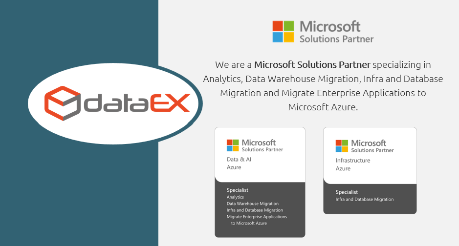

# Microsoft Fabric Hands-On for Health 2025

## What is it?

This repository contains resources and materials for a hands-on session on **Microsoft Fabric**, organized as part of an internal training event for **Microsoft Brazil**. The event is focused on the **Health Services Industry )** and is led by **DataEx** to demonstrate how Microsoft Fabric can be leveraged for advanced analytics and data engineering scenarios.

## Objective & Intent

1. **Internal Training**: Equip Microsoft professionals with practical knowledge about Microsoft Fabric through a guided hands-on session.
2. **Showcasing Capabilities**: Highlight key features of Microsoft Fabric, including its integration with Power BI, Synapse, and Data Engineering tools.
3. **Industry Alignment**: Tailor the training content to address the specific needs of the Health Industry.

Participants will have the opportunity to:

- Deploy and configure resources in Microsoft Fabric.
- Explore data analytics scenarios relevant to Health.
- Gain hands-on experience to better support customers in real-world implementations.

## :exclamation: IMPORTANT NOTES:

1. **Please review the [license agreement](https://github.com/microsoft/Azure-Analytics-and-AI-Engagement/blob/main/CDP-Retail/license.md) and [disclaimer](https://github.com/microsoft/Azure-Analytics-and-AI-Engagement/blob/main/CDP-Retail/disclaimer.md) before using any material in this repository.**
2. This training involves deploying resources in Microsoft Fabric, which may incur **Azure hosting costs**. These costs are not covered by Microsoft or DataEx for the purposes of this training.
3. Follow best practices for **security and compliance** before introducing any sensitive data into the environment. Refer to the **Azure Security Center** for guidance.

## Disclaimer

The resources and materials provided in this repository are for educational purposes only and are not guaranteed to comply with industry standards or regulatory requirements. Microsoft and DataEx make no warranties regarding the completeness or accuracy of the content or its suitability for specific scenarios.

Any technology or solutions demonstrated here are subject to change and are not indicative of future Microsoft product releases or updates.

By using the resources in this repository, you agree to the terms outlined in the [license agreement](https://github.com/microsoft/Azure-Analytics-and-AI-Engagement/blob/main/CDP-Retail/license.md).

## Copyright

© 2025 Microsoft Corporation and DataEx. All rights reserved.

You may only use the resources in this repository for the purpose of this training. Redistribution or modification of the resources is prohibited without explicit permission.

## Feedback

We welcome your feedback to improve the quality of our training. Please contact us at **[suporte@dataex.com.br](mailto:dataex-support@microsoft.com)** for any questions or suggestions.

## Contributing

This repository adheres to the [Microsoft Open Source Code of Conduct](https://opensource.microsoft.com/codeofconduct/). For more information, please refer to the [Code of Conduct FAQ](https://opensource.microsoft.com/codeofconduct/faq/) or reach out to **[opencode@microsoft.com](mailto:opencode@microsoft.com)** for assistance.
